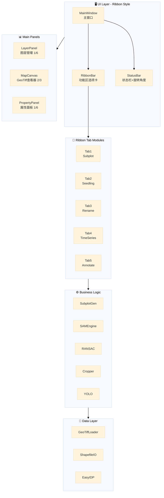

# EasyPlantFieldID GUI Application - 实现计划 (v3)

基于 PySide6 的地理信息预处理和结果获取与预览 GUI 应用程序。

> [!NOTE]
> 项目使用 **uv** 进行包管理和虚拟环境管理。

## 项目架构概述



---

## UI 整体布局

```
┌─────────────────────────────────────────────────────────────────────────────┐
│  [Ribbon Bar - Office Style Tabs]                                           │
│  ┌─────────┐ ┌─────────┐ ┌─────────┐ ┌─────────┐ ┌─────────┐               │
│  │ Subplot │ │Seedling │ │  ID     │ │  Time   │ │Annotate │               │
│  │ Generate│ │Position │ │ Rename  │ │ Series  │ │ Train   │               │
│  └─────────┘ └─────────┘ └─────────┘ └─────────┘ └─────────┘               │
│  ┌─────────────────────────────────────────────────────────────────────────┐│
│  │  [当前Tab的控制按钮和参数 - 集成在Ribbon中]                              ││
│  │  例如: [Load Image] [Load SHP] | Width:[__] Height:[__] | [Preview]     ││
│  └─────────────────────────────────────────────────────────────────────────┘│
├─────────────┬─────────────────────────────────────────────┬─────────────────┤
│ Layer Panel │                                             │ Property Panel  │
│   (1/6)     │          Map Canvas (2/3)                   │    (1/6)        │
│             │                                             │                 │
│ ┌─────────┐ │    ┌─────────────────────────────────┐      │ ┌─────────────┐ │
│ │ Layers  │ │    │                                 │      │ │ Parameters  │ │
│ │ ├─ DOM  │ │    │     GeoTiff Viewer              │      │ │             │ │
│ │ ├─ DSM  │ │    │     (PyQtGraph + rasterio)      │      │ │ Width: 10m  │ │
│ │ ├─ SHP  │ │    │                                 │      │ │ Height: 5m  │ │
│ │ └─ ...  │ │    │     支持平移/缩放/旋转          │      │ │ Spacing: 1m │ │
│ └─────────┘ │    │                                 │      │ │             │ │
│             │    └─────────────────────────────────┘      │ │ [Apply]     │ │
│ [+] [-]     │                                             │ └─────────────┘ │
├─────────────┴─────────────────────────────────────────────┴─────────────────┤
│  Status Bar: [坐标: X, Y] | [缩放: 100%] | [旋转角度: 0°] | [进度条]        │
└─────────────────────────────────────────────────────────────────────────────┘
```

---

## User Review Required

> [!IMPORTANT]
> **SAM3 源码**: 将 SAM3 源码放入 `lib/sam3/` 目录，避免官方 pip 安装导致的 numpy 版本冲突。模型权重文件由用户自行准备。

> [!IMPORTANT]
> **EasyIDP**: 将使用 `uv pip install -e "path"` 安装本地源码版本。

> [!NOTE]
> **已有实现参考**:
> - Tab1 小样地生成: [fieldShape.py](file:///d:/OneDrive/Program/GitHub/EasyPlantFieldID/dev.notes/qgis_subplot_plugin/fieldShape.py)
> - Tab2 SAM3 推理: [inference_slice.py](file:///d:/OneDrive/Program/GitHub/EasyPlantFieldID/dev.notes/sam3_slice/inference_slice.py)
> - Tab3 垄聚类: [14_order_by_ridge.py](file:///d:/OneDrive/Program/GitHub/EasyPlantFieldID/dev.notes/seedling_pos/14_order_by_ridge.py)
> - Tab4 时间切块: [21_slice_time.ipynb](file:///d:/OneDrive/Program/GitHub/EasyPlantFieldID/dev.notes/seedling_pos/21_slice_time.ipynb)
> - GeoTiff查看器: [02_demo_load_big_geotiff.py](file:///d:/OneDrive/Program/GitHub/EasyPlantFieldID/dev.notes/02_demo_load_big_geotiff.py)
> - 图层管理: [04_demo_layer_manage_drag.py](file:///d:/OneDrive/Program/GitHub/EasyPlantFieldID/dev.notes/04_demo_layer_manage_drag.py)
> - 旋转功能: [06_demo_layer_rotation.py](file:///d:/OneDrive/Program/GitHub/EasyPlantFieldID/dev.notes/06_demo_layer_rotation.py)

---

## Proposed Changes

### Core Framework (核心框架)

---

#### [NEW] [main_window.py](file:///d:/OneDrive/Program/GitHub/EasyPlantFieldID/src/gui/main_window.py)

主窗口框架:
- **Ribbon Bar**: Office 风格的功能区
- **状态栏**: 坐标、缩放比例、旋转角度
- **三栏布局**: 图层面板 | 地图画布 | 属性面板

---

#### [NEW] [ribbon_bar.py](file:///d:/OneDrive/Program/GitHub/EasyPlantFieldID/src/gui/components/ribbon_bar.py)

Ribbon 风格工具栏，每个Tab包含对应功能的控制按钮和参数输入。

---

#### [NEW] [map_canvas.py](file:///d:/OneDrive/Program/GitHub/EasyPlantFieldID/src/gui/components/map_canvas.py)

基于 `02_demo_load_big_geotiff.py` + `06_demo_layer_rotation.py`:
- 大型 GeoTiff 分块加载
- 图层旋转支持
- 交互模式: 平移/选点/绘制

---

#### [NEW] [layer_panel.py](file:///d:/OneDrive/Program/GitHub/EasyPlantFieldID/src/gui/components/layer_panel.py)

基于 `04_demo_layer_manage_drag.py`:
- 拖拽排序、可见性控制
- 右键菜单、双击重命名

---

### Tab Modules (功能模块)

详细设计见 v2 版本，此处省略重复内容。核心要点:

| Tab | 功能来源 | 核心文件 |
|-----|---------|---------|
| Tab1 | `qgis_subplot_plugin/fieldShape.py` | `subplot_generator.py` |
| Tab2 | `sam3_slice/inference_slice.py` | `sam_engine.py` |
| Tab3 | `seedling_pos/14_order_by_ridge.py` | `ransac_cluster.py` |
| Tab4 | `seedling_pos/21_slice_time.ipynb` | `time_series_cropper.py` |
| Tab5 | SAM3 + ultralytics | `yolo_trainer.py` |

---

## Directory Structure (目录结构)

```
EasyPlantFieldID/
├── .venv/                          # uv 虚拟环境
├── pyproject.toml                  # uv 项目配置
├── uv.lock                         # uv 锁定文件
├── README.md
├── main.py                         # 程序入口
│
├── lib/                            # 第三方库源码 (避免版本冲突)
│   └── sam3/                       # SAM3 源码 (从官方仓库复制)
│       ├── __init__.py
│       ├── model_builder.py
│       ├── model/
│       │   └── sam3_image_processor.py
│       └── ...
│
├── src/
│   ├── __init__.py
│   ├── gui/
│   │   ├── __init__.py
│   │   ├── main_window.py          # 主窗口 (Ribbon 风格)
│   │   ├── components/
│   │   │   ├── __init__.py
│   │   │   ├── ribbon_bar.py       # Ribbon 工具栏
│   │   │   ├── map_canvas.py       # GeoTiff 查看器
│   │   │   ├── layer_panel.py      # 图层管理
│   │   │   ├── property_panel.py   # 属性面板
│   │   │   ├── point_editor.py     # 点交互编辑器
│   │   │   └── polygon_editor.py   # 多边形编辑器
│   │   └── tabs/
│   │       ├── __init__.py
│   │       ├── subplot_generation.py
│   │       ├── seedling_detection.py
│   │       ├── seedling_renaming.py
│   │       ├── time_series_crop.py
│   │       └── annotation_training.py
│   ├── core/
│   │   ├── __init__.py
│   │   ├── geotiff_loader.py
│   │   ├── shapefile_io.py
│   │   ├── subplot_generator.py
│   │   ├── sam_engine.py           # 调用 lib/sam3
│   │   ├── ransac_cluster.py
│   │   ├── time_series_cropper.py
│   │   └── yolo_trainer.py
│   └── utils/
│       ├── __init__.py
│       ├── coordinate_transform.py
│       └── image_processing.py
│
├── dev.notes/                      # 开发参考代码 (现有)
│   ├── 01_demo_load_point_shp.py
│   ├── 02_demo_load_big_geotiff.py
│   ├── ...
│   ├── qgis_subplot_plugin/
│   ├── sam3_slice/
│   └── seedling_pos/
│
└── tests/
    ├── __init__.py
    ├── test_subplot_generator.py
    ├── test_ransac_cluster.py
    └── ...
```

---

## Dependencies (依赖) - uv 管理

更新 `pyproject.toml`:

```toml
[project]
name = "easyplantfieldid"
version = "0.1.0"
description = "GIS preprocessing and seedling detection GUI"
readme = "README.md"
requires-python = ">=3.12"

# 核心依赖
dependencies = [
    # GUI
    "pyside6>=6.10.0",
    "pyqtgraph>=0.13.7",
    
    # GIS 数据处理
    "geopandas>=1.1.1",
    "rasterio>=1.4.3",
    "shapely>=2.0.0",
    
    # 科学计算
    "numpy>=2.0.0",
    "scipy>=1.14.0",
    "scikit-learn>=1.5.0",
    "scikit-image>=0.24.0",
    
    # 工具
    "loguru>=0.7.3",
    "tqdm>=4.66.0",
]

[dependency-groups]
# SAM3 相关依赖 (源码在 lib/sam3/)
sam3 = [
    "torch>=2.7.0",
    "torchvision>=0.22.0",
    "timm>=1.0.17",
    "ftfy>=6.1.1",
    "regex",
    "iopath>=0.1.10",
    "opencv-python>=4.10.0",
    # 注意: 不使用 huggingface_hub, 权重文件自行准备
]

# YOLO 训练依赖
yolo = [
    "ultralytics>=8.3.203",
]

# 开发依赖
dev = [
    "pytest>=8.4.2",
    "pytest-qt>=4.5.0",
    "black>=24.0.0",
    "ruff>=0.8.0",
]

# Notebook 依赖 (可选)
notebooks = [
    "jupyter",
    "matplotlib",
    "ipywidgets",
]

[tool.uv]
# EasyIDP 本地安装示例:
# uv pip install -e "/path/to/easyidp"
```

---

## 常用 uv 命令

```bash
# 创建虚拟环境并安装依赖
uv sync

# 安装特定依赖组
uv sync --group sam3
uv sync --group yolo
uv sync --group dev

# 安装 EasyIDP (本地源码)
uv pip install -e "/path/to/easyidp"

# 运行程序
uv run python main.py

# 运行测试
uv run pytest tests/ -v
```

---

## Verification Plan

### Automated Tests

```bash
# 运行所有测试
uv run pytest tests/ -v

# 运行特定模块测试
uv run pytest tests/test_subplot_generator.py -v
```

### Manual Verification

1. **UI 测试**: 使用 `dev.notes/files/` 测试数据
2. **功能测试**: 各 Tab 完整工作流测试

---

## Implementation Order (实现顺序)

| Phase | 内容 | 预计时间 |
|-------|------|---------|
| 1 | 核心 UI 框架 (main_window, ribbon, map_canvas, layer_panel) | Week 1 |
| 2 | Tab1 小样地生成 | Week 2 |
| 3 | Tab2 & Tab3 (SAM3 + RANSAC) | Week 3-4 |
| 4 | Tab4 时间序列 | Week 5 |
| 5 | Tab5 标注训练 | Week 6 |
